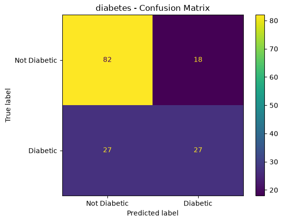
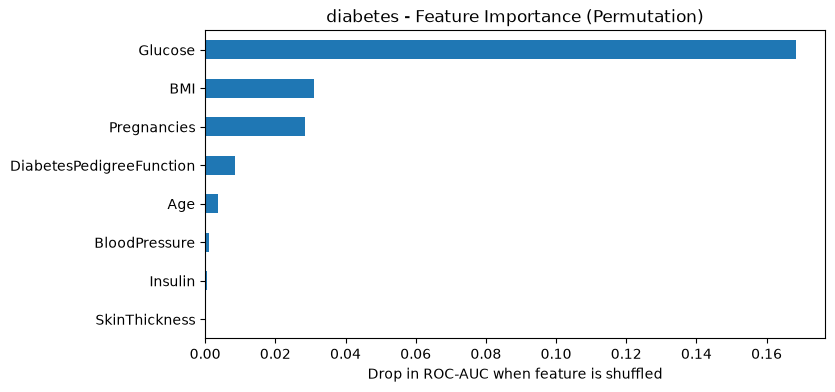
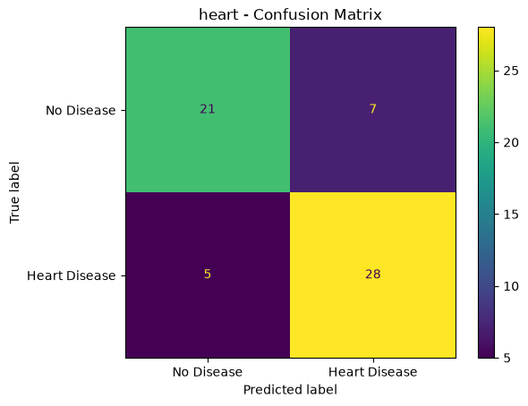
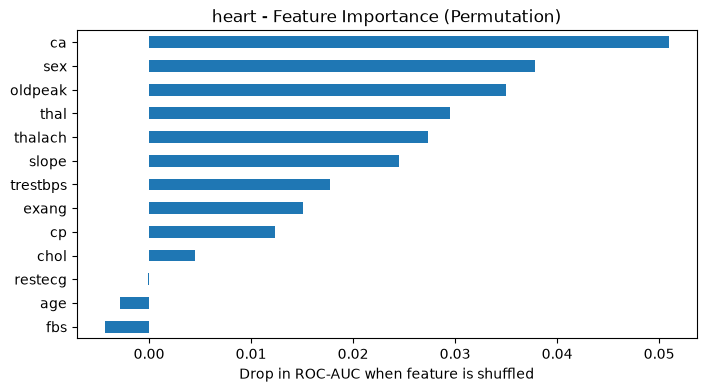
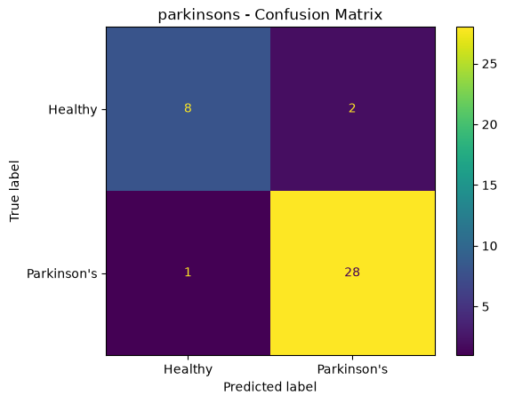
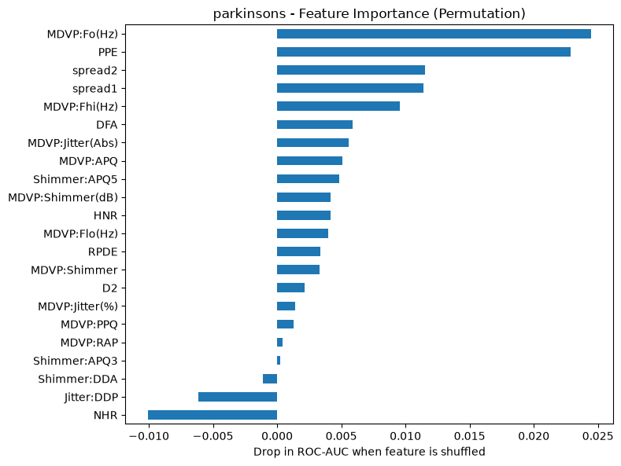

# Multiple Disease Prediction System

A small machine learning web app that predicts the risk of Diabetes, Heart Disease and Parkinson's from medical inputs. I built it to learn how a full ML project works: cleaning data, comparing models, checking results and putting the model in an app.

**This is a learning project. It is NOT a medical tool and gives no medical advice.**

**Live demo:** https://jatin-health-ml.streamlit.app

## Datasets
- Diabetes: [Pima Indians Diabetes Database](https://www.kaggle.com/datasets/uciml/pima-indians-diabetes-database)
- Heart Disease: [Heart Disease Dataset](https://www.kaggle.com/datasets/johnsmith88/heart-disease-dataset)
- Parkinson's: [Oxford Parkinson's Disease Detection Dataset (UCI)](https://archive.ics.uci.edu/dataset/174/parkinsons)

## What I did
- Cleaned the data. In the diabetes data, zeros in Glucose, BloodPressure, SkinThickness, Insulin and BMI cannot be real values, so I treated them as missing.
- Removed duplicate rows from the heart data, so the same patient does not appear in both training and testing.
- Compared four models: Logistic Regression, Random Forest, SVM and Gradient Boosting, using 5-fold cross-validation.
- Used sklearn Pipelines (fill missing values, scale, then model) so no test data leaks into training.
- Checked results with accuracy, precision, recall, F1, ROC-AUC and a confusion matrix.
- Used permutation feature importance to see which inputs the model depends on.
- Built a Streamlit app with a Low / Medium / High risk level and a what-if chart that shows how the risk changes when one input changes.

## Results (on the test set)
| Disease | Best model | ROC-AUC |
|---|---|---|
| Diabetes | Logistic Regression | 0.81 |
| Heart Disease | Logistic Regression | 0.87 |
| Parkinson's | Random Forest | 0.96 |

### Diabetes

### Heart Disease

### Parkinson's

## What I found
- Simple Logistic Regression gave the best score for both Diabetes and Heart Disease. A more complex model is not always better, especially on small datasets.
- Random Forest worked best for Parkinson's, but I do not fully trust that 0.96. The same person has many recordings in the data, so the score is probably too optimistic (see Limitations).
- Handling the data properly mattered a lot. Fixing the fake zeros in the diabetes data and removing duplicates in the heart data made my results more honest.
- Without removing duplicates, the heart scores would have looked better than they really are, because the same row could be in both train and test.
- In a health problem, missing a sick person is worse than a false alarm. So I looked at recall, not only accuracy.

## Limitations
- The datasets are small, so the results may not hold on new data.
- The Parkinson's data has several voice recordings from the same person. A random split can put the same person in both train and test, so its score may look better than it really is.
- The Low / Medium / High risk cut-offs (0.33 and 0.66) are my own choice for display. They are not clinical thresholds.
- The models are not tested by doctors or in a real hospital.

## What I learned
- Why a Pipeline protects against data leakage.
- Why accuracy alone can be misleading, and why recall matters in health problems.
- That cleaning the data takes more time than training the model.
- How to take a model from a notebook to a live app.

## Run it on your computer
    pip install -r requirements.txt
    streamlit run app.py

To retrain the models, open the notebooks in the `notebooks` folder (needs `matplotlib`, `seaborn` and `jupyter`).

## Project structure
    assets/      charts and results tables
    data/        the 3 csv files
    models/      saved trained models
    notebooks/   one notebook per disease
    src/         shared training code
    app.py       Streamlit app